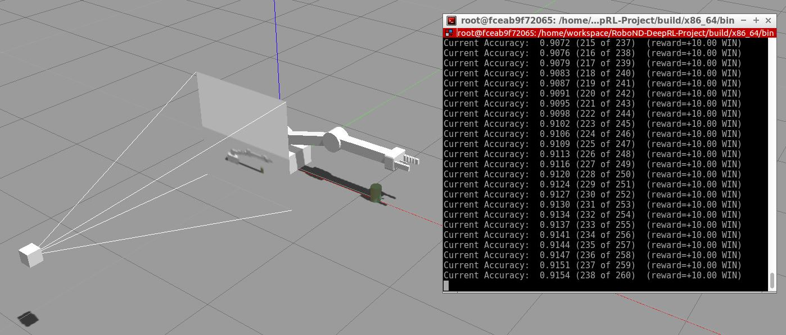

# Deep Reinforcement Learning Arm Manipulation

*This repository presents my solution to the [Udacity Deep Reinforcement Learning Arm Manipulation Project](https://github.com/udacity/RoboND-DeepRL-Project). A Deep Reinforcement Learning algorithm is trained to control a robotic arm in order to reach a specific target. The network input data is entirely based on a camera raw pixels.*

*The Deep RL algorithm uses raw input data from a simulated camera to predict best action for the robotic arm.*

## Objective

A robotic arm needs to reach a target object in an environment by moving its different joints. While its control could be engineered through a detection of its position and target object, we want to develop a deep reinforcement learning algorithm that will learn through trial and error the best actions in order to reach its goal.

The environment is created with gazebo and the robotic arm is controlled through ROS. A camera with a fixed view towards the robotic arm and the target object is simulated and capture raw pixels.

The camera data is fed to a neural network that predicts actions to perform and calculate the value network based on state and action transitions. The value is based on an observation (or reward) provided by the environment to the agent (the robotic arm) and representing success and failure of the mission, as well as how well the robot is currently performing (for intermediary rewards).

The neural architecture uses convolutional neural networks in order to process the images and LSTM cells to memorize the different steps leading to a specific state (temporal effect).

The robot acts based on the policy created by the neural network and explores sometimes different situations in order to refine its policy. The different experiences are recorded in order to train the neural network in batch.

## Definition of actions

In this simulation, two joints from the robotic arm are controlled. The algorithm can adjust the position of each joint by modifying its angle.

For each joint, three actions can be taken, as long as the extreme values of the joints are respected:

- increase slightly its angle, ie rotate in one direction,
- decrease slightly its angle, ie rotate in the other direction,
- do nothing.

The policy for the RL algorithm has been developed so both joints can be controlled simultaneously. The value of the action is defined as `3 x "Action for Joint 1" + "Action for Joint 2"`, each possible joint action having a value from the set [0, 1, 2]. This let define a simple network able to directly act on all its controls at the same time.

## Definition of rewards

The reinforcement learning algorithm is trained through rewards provided by the environment. The robot performs a sequence of actions and its experience as well as the raw input data from the camera is captured.

Different rewards are sent during a full episode:

- If the gripper from the robot successfully reaches its target, a reward of +10 is sent.
- If a collision occurs with the target object from a different part of the robotic arm, or if the gripper got in contact with the ground, a penalty of -1 is sent.
- If the robotic arm has not reached the target object after 100 actions, a penalty of -1 is sent.
- After every action, an intermediary reward is sent to the robot and is based on how closer the agent got to its target. A time penalty of -0.01 is added to every action to penalize actions that don't help the robot getting closer to its target.

The intermediary rewards guide the robot and help train the Deep RL faster, which would otherwise have sparse rewards if we only waited for the end of each experience. The time penalty helps the algorithm encourage actions that go faster towards the goal.

Since we can move both joints at the same time, we don't need to use any moving average of distance for stability. There should be almost always a combination of joints movement so that the gripper get closer to its target.

The final rewards are higher than the intermediary rewards to give a strong incentive to the learning agent to reach the goal, and ensures it won't focus mainly on the intermediary rewards. The winning reward is higher in absolute value than the losing reward to encourage the agent take actions in order to reach its target despite the potential risks.

## Definition of hyper-parameters

Several hyper-parameters had to be tuned for the algorithm to work properly:

Q-Learning parameters:

- EPS_START, EPS_END & EPS_DECAY: greedy values associated to exploration parameters. They represent how often the agent explores a random action. We start at 0.9 (90%) and slowly go towards 0.05 (5%) with a decay of 200 steps. This let the agent try a lot of different possibilities of actions until it learns which ones are the best and follows mainly its value policy.
- GAMMA: discount factor on value of future state. We use the standard value of 0.9.

Neural network parameters:

- INPUT_WIDTH, INPUT_HEIGHT: size of input image for convolutional neural network. We use 64 as it is sufficient to visualize the arm position and the object and help to train faster.
- OPTIMIZER: optimizer used for training the neural network. We use RMSprop due to its performance.
- LEARNING_RATE: we use 0.01 in order to update the weights fast enough.
- REPLAY_MEMORY: number of experiences recorded to sample from for training the neural network. 10000 frames is enough to cover a large portion of the possible states.
- BATCH_SIZE: we train in batch of 32 samples.
- LSTM_SIZE: we use 256 cells to memorize previous states & actions. A too low value would disconsider any temporal effect while a too high value would make training longer and could lead to over-fitting.

While some of the parameters were not as important when the objective was to reach the target object with any part of the robotic arm, a fine tuning was necessary to ensure the object would enter in contact with the gripper portion of the arm.

## Results

An accuracy above 90% can quickly be achieved when the target object can be reached through any part of the robotic arm.

The agent will quickly repeat successful series of action when he first reaches the target. As long as the algorithm is correctly implemented, the different hyper-parameters don't need much tuning to achieve this result. A preference is given to lower neural network parameters (image size and LSTM size in particular) in order to decrease its complexity.

The final rewards need to be correctly set to give an accurate feedback on success/failure of the experience to the agent. The intermediary rewards give a feedback on how well the actions are currently performing and using the distance between the gripper and the target object is sufficient.

When the objective is to reach the target with the gripper portion of the arm, the problem becomes more difficult and the hyper parameters are fine tuned as per previous section. We reach 80% accuracy after a longer time because the robot takes longer to have successful experiences and its movements need to be more precise.

## Future Work

The Deep Reinforcement Learning algorithm can be improved in several ways:

- it can be trained longer to accumulate more experiences,
- the size of the input image for the convolutional neural network can be larger to observe more details,
- the number of LSTM cells can be higher to record temporal effect, which would be particularly useful if the base of the arm needs to rotate,
- the input image while training the neural network can be augmented in order to consider any variation in the camera position and angle as well as sensor noise,
- the speed of the joints can be simultaneously be adjusted as additional possible actions following same principle as described previously.
